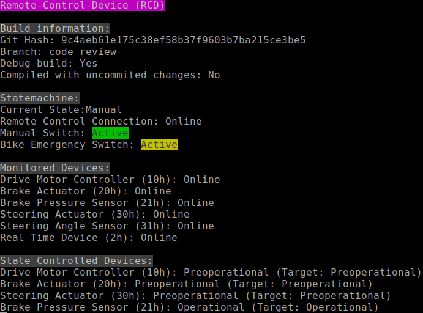
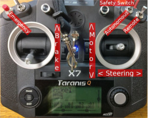
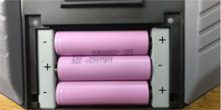
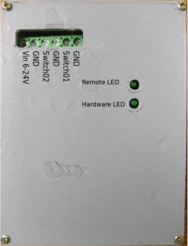
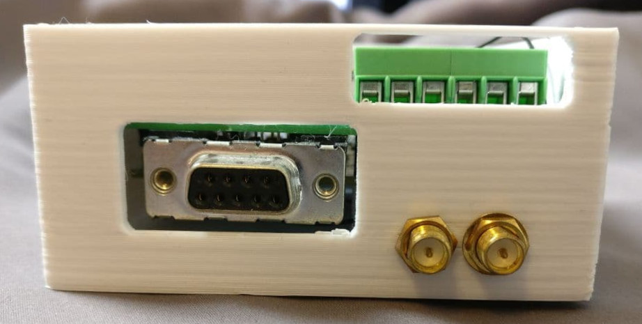
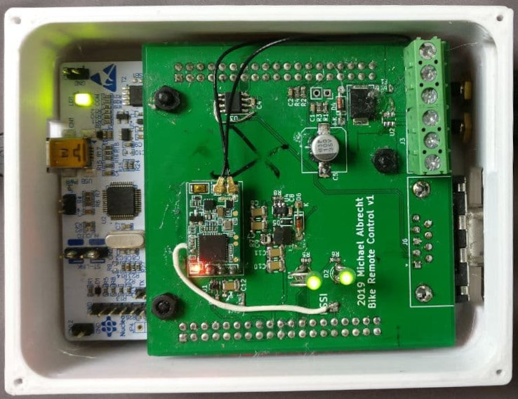

# remote_control2 

Firmware, KiCAD files, 3D designes of an embedded STM32 based device I was commissioned to create for an autonomous bike.
It reads receives stick positions from a hobby remote control (FrSky based) and controls various actors around the bike. Also serves as a CANopen bus master, monitoring for timeouts and handling some safety aspects.   
The firmware is fully unit tested and fuzzed using American Fuzzy Lop. 

Remote control system for the autonomous bike(s) based on:
 
* FrSky's QX7 remote control
* FrSky's XM+ diversity, non-telemetry receiver
* OpenTX remote control firmware
* ST's NUCLEO-F302R8 board
* custom adapter board
* CANfestival CANopen stack
* STM32 Cube HAL 
* FreeRTOS 

### Project overview / folder stucture
<pre>
remote_control
|-- hardware*          **General information and assembly instructions**
|   |-- 3D             3D models of the units case
|   |-- datasheets     all relevant datasheets of components used in the custom adapter board
|   |-- adapterBoard   KiCAD 5 files
|   |   |-- bom        Interactive BOM for PCB assembly
|-- firmware*          **Code for the micro controller**
</pre>
\* contains extra readme

### General usage of remote control (radio)

Switch on the remote control by holding the center button for 2 seconds. The remote control device in the bike will be in *start* mode until radio link is engaged and all canbus devices area ready. Beware that getting **too close** to the antennas of the RDC with the radio will cause it to loose connection due to overload (the receiver is very sensitive).
The radio will start beeping if left untouched for more than 60 minutes or if the batteries get low. It will never shut off by itself and **will** kill the batteries if signals are ignored.   

To enable any mode the safety switch (momentary - will return to by it's own to default position) has to be flipped up **before** activating either of the two mode switches.
Remote mode will not activate if the throttle is raised. If two modes are activated at the same none will activate.

Emergency can be pressed at at any time. When inside remote or autonomous all switches have to be returned to idle to
leave emergency. Emergency will only be active for the duration of the button press when bike is idling.   

Manual mode overrides **all** control of the bike; even emergency. When exiting manual the bike will not be directly returning to the previous mode.  

### Remote control device LED codes
The LEDs of the device can be in the following states

- off/dim
- fast blinking
- on
- counting (blinking for *n* cycles, off for longer time, repeating)

##### Hardware LED

- off/dim: device is starting
- fast blinking:
    waiting for all canfestival nodes to start up
    no actor values will be sent until this is done
- on: (no errors)
- counting mode:
    - lower counts overwrite higher ones (lower = more important error)
    - 1 count: can network error
    - 2 count: brake heartbeat timeout
    - 3 count: steering timeout
    - 4 count: wheel motor timeout

##### Remote LED

- on: remote control connection established (no errors)
- fast blinking: manual mode (overwrites connection lost / established)
- off: connection lost

### Wiring of remote control device
Input voltage 6-24V (reverse polarity protected) or USB powered through nucleo. ESD protection only rudimentary due to layout error. 
Do not power up device without antennas attached it may shorten the lifespan of the receiver. Switch 01 = manual mode. Switch 02 = hard emergency. Just connect a switch, pull-up is provided by the board.

## Device pictures

